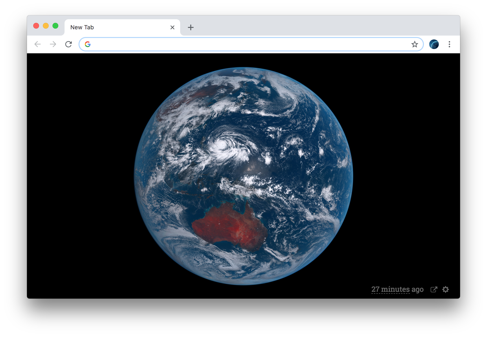
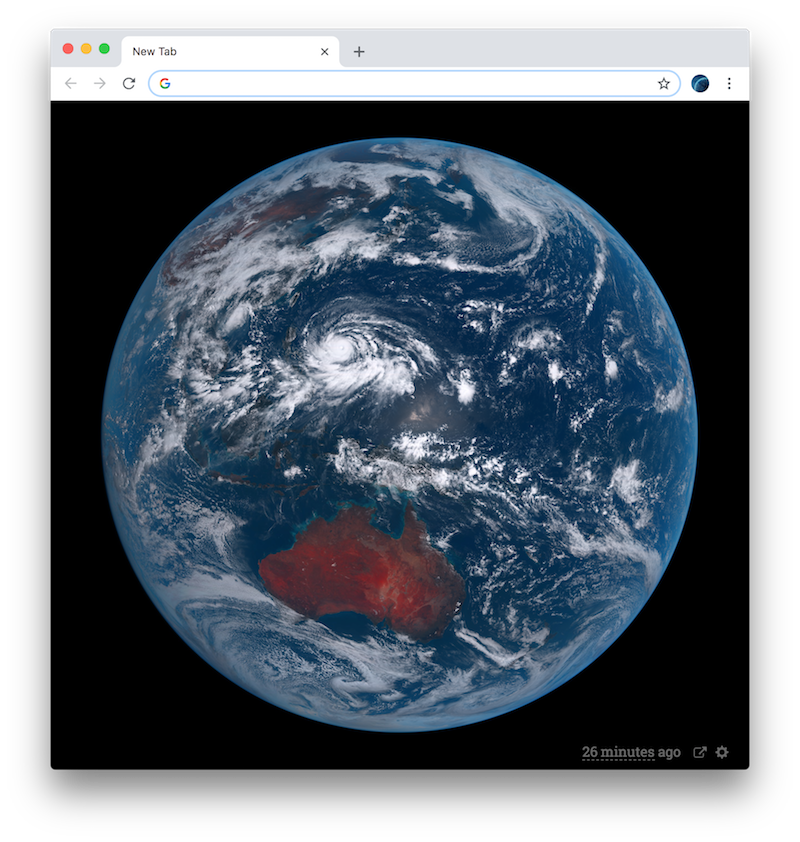
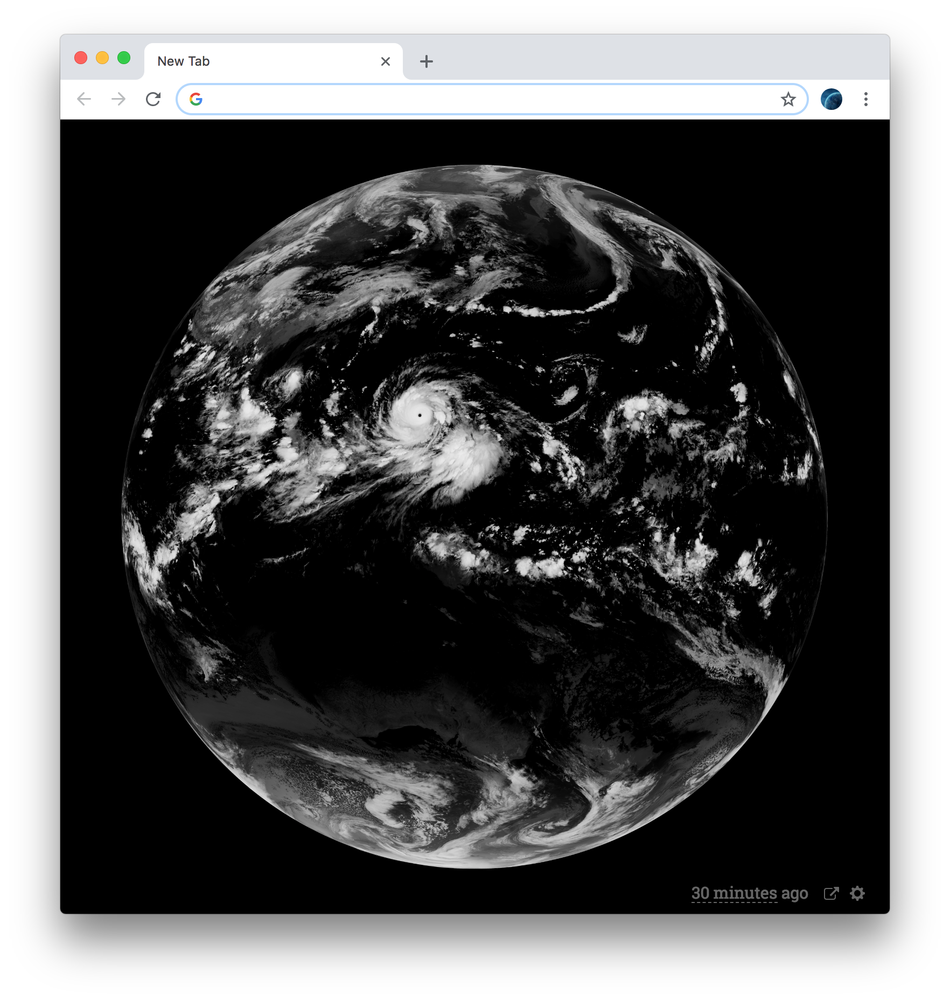
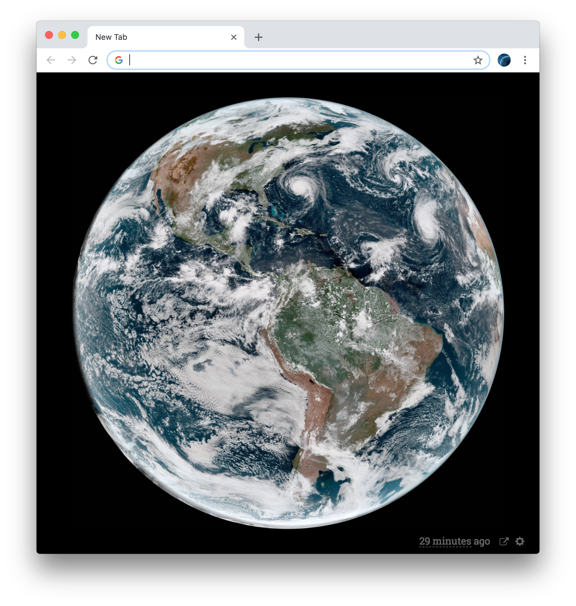
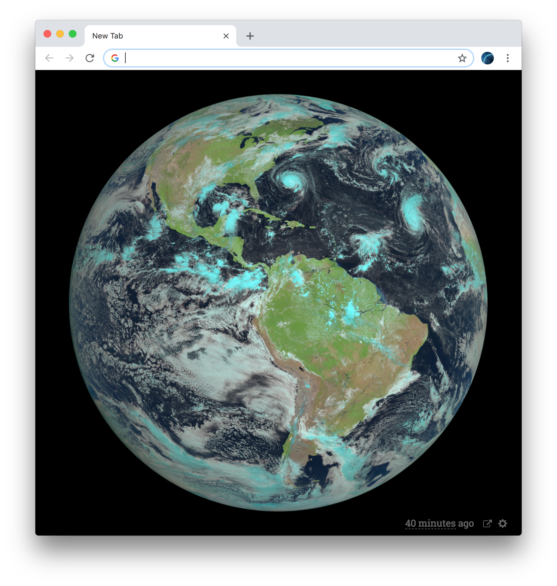
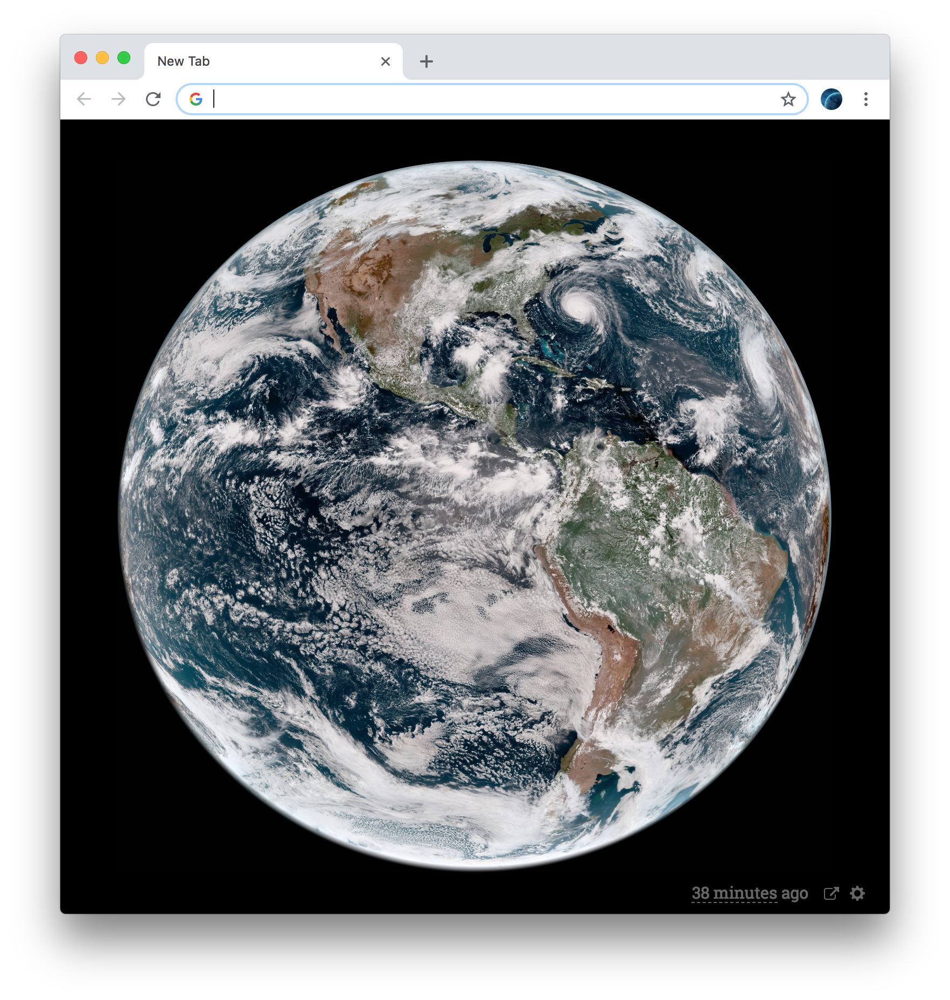
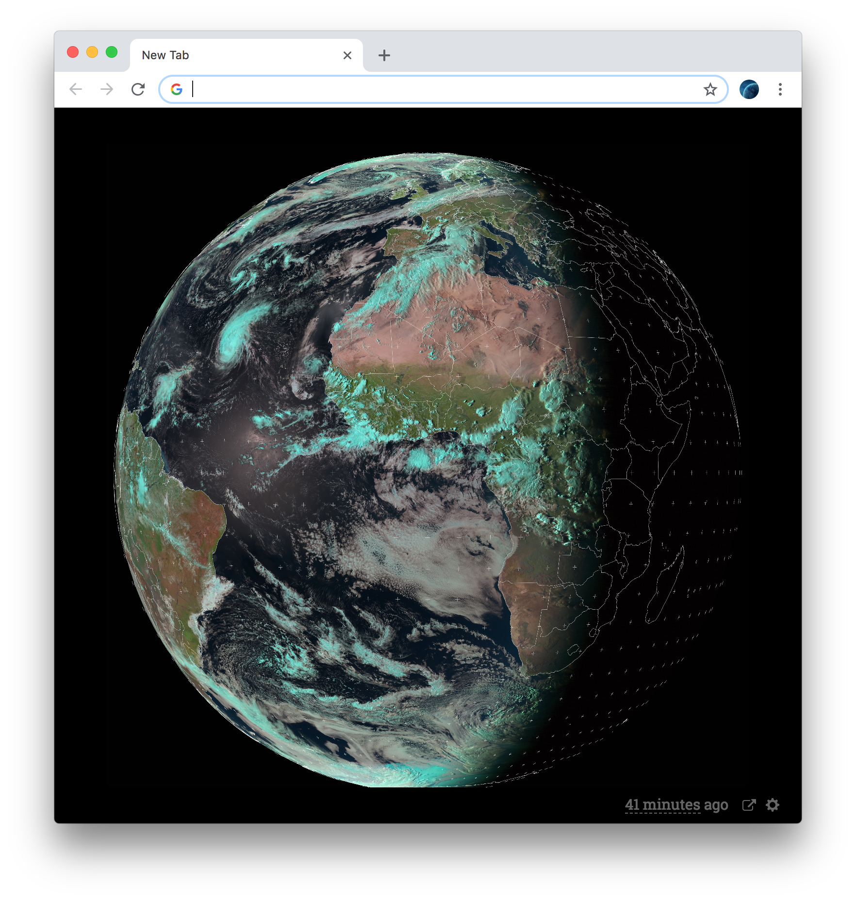
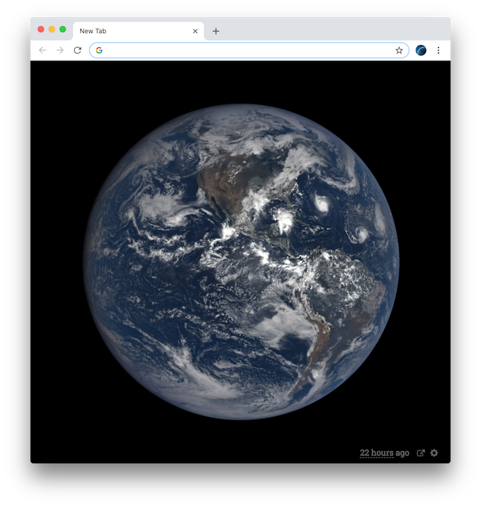
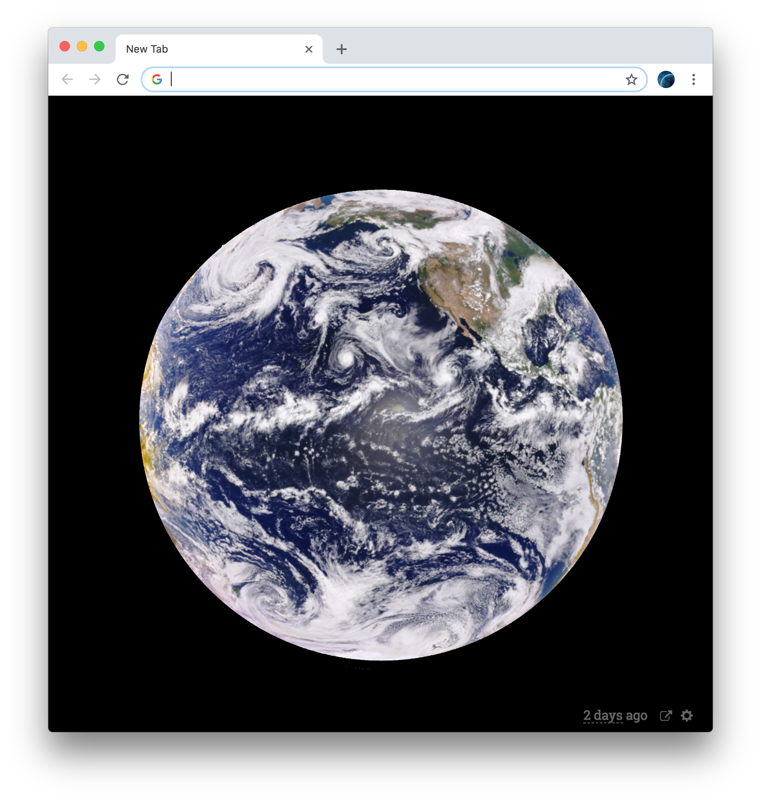
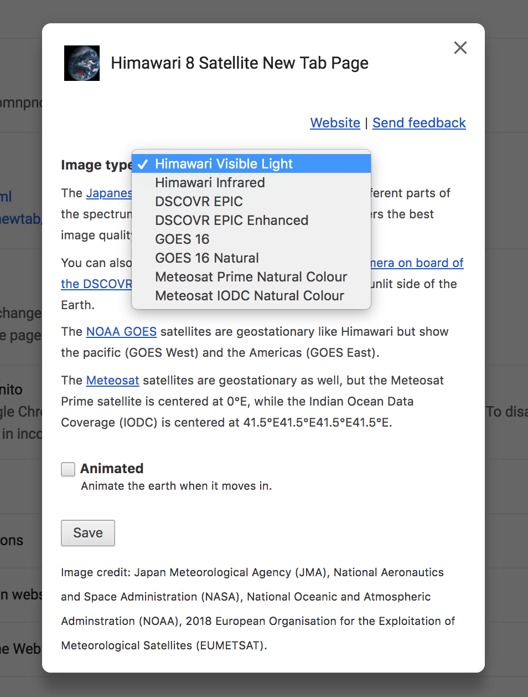

# Himawari 8 New Tab Page (Chrome and Firefox)

Experience the latest image taken by the [geostationary](https://en.wikipedia.org/wiki/Geostationary_orbit) [Himawari 8 satellite](http://himawari8.nict.go.jp/) every time you open a new tab in Chrome or Firefox. The Himawari satellite has been deployed by the [Japan Meteorological Agency](http://www.jma.go.jp/jma/indexe.html) and takes photographs of Earth every 10 minutes. Since the new tab page is a simple web page, you can also [try it online](https://domoritz.github.io/himawari-8-chrome).

🛰 **Get the extension from the [Chrome web store](https://chrome.google.com/webstore/detail/himawari-8-new-tab-page/llelgapflianaapmnpncgakfjhfhnojm) or the [Firefox Add-on gallery](https://addons.mozilla.org/en-US/firefox/addon/satellite-new-tab-page/)**.



<p align="center">
  
  
  
  
  
  
  
  
</p>

This extension is inspired by https://glittering.blue/, https://github.com/jakiestfu/himawari.js/ and https://github.com/ungoldman/himawari-urls.

## Features of the extension

* Switch between visible light and infrared images from [Himawari 8](http://himawari8.nict.go.jp/), images from the EPIC camera on the [DSCOVR](http://www.nesdis.noaa.gov/DSCOVR/) satellite, [GOES 16](https://en.wikipedia.org/wiki/GOES_16), [GOES 16](https://en.wikipedia.org/wiki/GOES_17), and [Meteosat](https://www.eumetsat.int/website/home/Satellites/CurrentSatellites/Meteosat/index.html) (can only switch in the extension).
* Loads the latest image, updates automatically.
* Automatically loads images at the optimal resolution (including retina resolutions). If more than one image is needed, the app automatically downloads tiles.
* Uses Google's caching to take the load from the image servers.
* Caches last version in local storage (compressed JPEG) and immediately displays it when you load the page. Then loads the latest image.
* JSON proxy on AppEngine to get around same origin policy. The code is on the [proxy branch](https://github.com/domoritz/himawari-8-chrome/tree/proxy).
* To get the latest image URL for Meteosat, we use a [web scraper](https://github.com/domoritz/himawari-8-chrome/tree/meteosat).
* Full offline support.
* Images are drawn on a canvas so that we can cache and load it easily.
* The Earth always stay centered, thanks to CSS magic.
* Earth is animated when it moves in (optional).

Here is a screenshot of the options dialog in Chrome:



## Changelog

```
0.17.0 Add GOES 17
0.16.1 Store large images with reduced quality until they fit
0.16.0 Add Meteosat images thanks to @erget
0.15.0 Add GOES 16 natural image thanks to @TheNeuralBit
0.14.0 Remove GOES 13 and 15 as NASA does not support them anymore
0.13.1 Faster time ago update
0.12.0 Improve animation initialization
0.11.1 Faster animation
0.11.0 Add GOES 16 and animation
0.10.0 Firefox support
0.9.0 Fix web extension compatibility. Immediately load new image when settings change.
0.8.0 Compatible with web extensions for Firefox
0.6.1, 0.7.0: Fix GOES caching
0.6.0: Add GOES 13 and GOES 15 images (see options). Fix issues with DSCOVR.
0.5.0: Fix issues with DSCOVR. Add enhanced images for DSCOVR.
0.4.3: Fix issue with latest date for himawari color image
0.4.2: Fix DSCOVR EPIC base url
0.4.0: Add DSCOVR images and link to explore online
0.3.2: Improve styling
0.3.1: Fix issue with options.html and options.js missing
0.3.0: Add option to choose infrared image
0.2.5: New proxy server
0.2.2: Better layout
0.2.1: Faster loading, offline support
```

## Planned features

**Contributions welcome**

* Automatically download a better image if the window is resized
* Time travel
* Actual logo/ icon
* Error handling


## Demo

Have a look at the [latest image from Himawari 8](https://domoritz.github.io/himawari-8-chrome).


## Develop

Install the latest dependencies with [`yarn`](https://yarnpkg.com/). Then run `yarn watch` in one terminal to compile the bundle in the background. At this point you can choose between two methods to view the page. First, you can run `yarn start` to start the webserver at [localhost:8000](http://localhost:8000/). Note that if you are using this method, you cannot access some browser extension specific features. Second, install the extension as an [unpacked extension into Chrome](https://developer.chrome.com/extensions/getstarted) or Firefox and open a new tab. The extension should load in development mode.

To make a release, update the version number in `package.json` and `manifest.*.json`. Then commit the changes and tag it. Lastly, pack the extension (`yarn bundle`), push the code and tags, and deploy on the chrome app store.
